# Waveforms Audio

Flutter audio visualizers for voice chat, assistants, music, and waveform previews.
The package turns PCM samples into animated shapes. Your app supplies the audio;
recording, playback, microphone permissions, and compressed audio decoding stay in
your app or audio SDK. Runtime code depends only on Flutter.

## Install

Requires **Flutter 3.47.0 or newer** and **Dart 3.13.0 or newer** within Dart 3.x.

```yaml
dependencies:
  waveforms_audio: ^0.2.4
```

Run `flutter pub get`, then import:

```dart
import 'package:waveforms_audio/waveforms_audio.dart';
```

## Choose a widget

| Widget | Use it for | Input |
| --- | --- | --- |
| `VoiceChatVisualizer` | Calls and AI voice interfaces, with speaker colors | Controller, or mono PCM stream + rate |
| `ReactiveAudioVisualizer` | Frequency-driven visuals with FFT and silence controls | Controller, or mono PCM stream + rate |
| `AudioVisualizer` | Prepared waveform snapshots | `AudioData` |
| `LiveAudioVisualizer` | Scrolling amplitude history | Mono PCM stream; one peak per chunk |

## Quick start: audio from an API

Flow: **audio source → controller → widget**. Create the controller once, outside
`build()`. Describe the actual source format; this example expects **24 kHz, mono,
signed PCM16, little-endian**, without a WAV or other container header.

```dart
import 'dart:async';
import 'package:flutter/material.dart';
import 'package:waveforms_audio/waveforms_audio.dart';

class ApiVoiceView extends StatefulWidget {
  // Supply a stable stream from your audio SDK or WebSocket.
  const ApiVoiceView({super.key, required this.pcmStream});

  final Stream<List<int>> pcmStream;

  @override
  State<ApiVoiceView> createState() => _ApiVoiceViewState();
}

class _ApiVoiceViewState extends State<ApiVoiceView> {
  late final ReactiveAudioController audio;
  StreamSubscription<List<int>>? input;

  @override
  void initState() {
    super.initState();
    audio = ReactiveAudioController(
      format: const AudioFormat(
        encoding: AudioEncoding.pcm16,
        sampleRate: 24000,
      ),
    );
    // Attach the visualizer before forwarding input to the broadcast controller.
    WidgetsBinding.instance.addPostFrameCallback((_) {
      if (!mounted) return;
      input = widget.pcmStream.listen(
        audio.addBytes,
        onError: (Object error, StackTrace stack) => audio.addError(error, stack),
        onDone: audio.flush,
      );
    });
  }

  @override
  Widget build(BuildContext context) => VoiceChatVisualizer(
    controller: audio,
    speaker: VoiceChatSpeaker.remote,
    style: const VoiceVisualizerStyle.ribbon(
      colors: [Colors.blue, Colors.cyan, Colors.purple],
    ),
    onError: (error, stack) => debugPrint('Audio input failed: $error'),
  );

  @override
  void dispose() {
    final subscription = input;
    if (subscription != null) unawaited(subscription.cancel());
    unawaited(audio.dispose());
    super.dispose();
  }
}
```

Mount it with `ApiVoiceView(pcmStream: yourPcmStream)` inside your Flutter app.
Keep that stream stable for the lifetime of this example, or give the view a new
key when replacing the source. Start live audio after the view subscribes: neither
the controller nor a broadcast input replays earlier events. A visualizer manages
its own subscription but **does not dispose a controller you supplied**.

Feed remote/AI PCM at playback time so the animation follows what the user hears.
MP3, AAC, Opus, and container files must first be decoded to headerless PCM.

## Audio formats and input functions

### `AudioFormat`

| Parameter/property | Default | Meaning |
| --- | --- | --- |
| `encoding` | Required | `AudioEncoding.pcm16`, `.pcm24`, or `.float32` |
| `sampleRate` | Required | Source samples/second, at least 8000 Hz |
| `channels` | `1` | Positive number of interleaved channels |
| `endian` | `Endian.little` | Sample byte order; import `dart:typed_data` for `Endian.big` |
| `channel` | `null` | Zero-based channel to select; null averages all channels to mono |
| `bytesPerSample` | Computed | 2, 3, or 4 bytes per channel sample |
| `bytesPerFrame` | Computed | `bytesPerSample * channels` |

For stereo input use `channels: 2`; `channel: 1` selects the right channel.
The channel index must be less than `channels`. Decoding clamps finite values to
-1–1 and replaces nonfinite Float32 values with zero.

### `ReactiveAudioController`

Constructor: `ReactiveAudioController({required format, sampleRate})`.
`format` describes source PCM; optional `sampleRate` fixes the **output** rate and
defaults to `format.sampleRate`. Rates must be positive; reactive widgets require
at least 8000 Hz. Encoding and channel layout remain fixed for the controller.

| Member | Behavior |
| --- | --- |
| `format` | Default source format |
| `sampleRate` | Output sample rate used by visualizers |
| `stream` | Asynchronous broadcast `Stream<List<double>>` of normalized mono PCM; no replay |
| `isClosed` | Whether input is closed |
| `addBytes(List<int> bytes, {int? sourceSampleRate})` | Decode raw PCM and resample if necessary; retains split frames between chunks |
| `addBase64(String payload, {int? sourceSampleRate})` | Same input path for plain base64 or `data:*;base64,...`; invalid base64 throws `FormatException` |
| `addSamples(Iterable<num> samples, {int? sourceSampleRate})` | Already-mono samples; clamp to -1–1, replace NaN/infinity with zero, then resample |
| `addError(Object error, [StackTrace? stackTrace])` | Forward an error without closing or resetting input |
| `flush()` | Emit the pending resampler tail, reset interpolation, discard partial byte frames |
| `resetDecoder()` | Discard both partial byte frames and resampler history without emitting a tail |
| `close()` | Flush, then close the output stream; returns `Future<void>` |
| `dispose()` | Alias for `close()` |

Add methods and `flush()` throw `StateError` after closure. Invalid source rates
throw `ArgumentError`. Stop/cancel upstream input before disposing. Closing can
wait for a paused listener to resume; the controller cannot be reopened.

### Resampling and segment boundaries

```dart
final audio = ReactiveAudioController(
  format: const AudioFormat(
    encoding: AudioEncoding.pcm16,
    sampleRate: 24000,
  ),
  sampleRate: 48000, // Fixed output rate.
);

// Examples: choose the input form provided by your source.
audio.addBytes(pcmBytes, sourceSampleRate: 16000);
audio.addBase64(base64Pcm, sourceSampleRate: 24000);
audio.addSamples(monoSamples, sourceSampleRate: 44100);
audio.flush(); // End of an utterance/independent segment.
```

`sourceSampleRate` defaults to `format.sampleRate` **on each call**; an override
is not sticky. Rate changes flush the previous segment and discard incomplete
PCM frames. Keep chunks of one continuous source at the same rate. Call `flush()`
at an utterance boundary, or `resetDecoder()` to drop unfinished audio. Output
chunk sizes can differ from input sizes; an input chunk may produce no output.

The lightweight linear resampler preserves timing across chunks, including
16/24/44.1/48 kHz conversions. It is intended for visualization and does not apply
an anti-aliasing filter for high-fidelity downsampling.

### Low-level adapters

These exported helpers work without widgets or a controller.

| API | Parameters and result |
| --- | --- |
| `AudioDecoder(AudioFormat format)` | Fixed PCM format, exposed as `format`; one decoder per independent source |
| `AudioDecoder.addBytes(List<int> bytes)` | Complete frames → normalized mono `Float32List`; retains incomplete trailing bytes |
| `AudioDecoder.addBase64(String payload)` | Plain base64/data URL → same decoded output; invalid base64 throws `FormatException` |
| `AudioDecoder.reset()` | Discard partial frame bytes; does not change format |
| `Pcm16Decoder()` | Simple mono PCM16 little-endian decoder; no container headers or stereo |
| `Pcm16Decoder.addBytes(Uint8List bytes)` | Signed normalized `List<double>`; retains one odd trailing byte. Create a new decoder to reset |
| `PcmResampler({required int sourceSampleRate, required int targetSampleRate})` | Fixed positive input/output Hz; exposed as properties; invalid rates throw `ArgumentError` |
| `PcmResampler.addSamples(List<double> samples)` | Finite normalized mono PCM → resampled `Float32List`; preserves phase, empty input leaves state intact |
| `PcmResampler.flush()` | Extend the final sample through its remaining duration, return the tail, then reset |
| `PcmResampler.reset()` | Drop interpolation history and pending tail |

`AudioDecoder` and `Pcm16Decoder` do not resample. `PcmResampler` does not clamp,
decode, or sanitize its input; use the controller when those steps are needed.

## Reactive widget parameters

Both widgets accept **either** `controller` **or** `audioStream` + `sampleRate`.
For direct streams, samples must be normalized mono PCM, not FFT bins or peaks.
The rate must match the supplied samples; it is unrelated to screen refresh rate.

```dart
ReactiveAudioVisualizer(
  audioStream: monoPcmStream, // Stream<List<double>>
  sampleRate: 48000,
  style: const VoiceVisualizerStyle.wave(),
  motionPreset: AudioMotionPreset.music,
);
```

### Shared parameters

| Parameter | Default | Meaning |
| --- | --- | --- |
| `key` | `null` | Standard Flutter widget identity key |
| `controller` | `null` | Format-aware input; caller retains ownership |
| `audioStream` | `null` | Direct normalized mono input; widget owns only its subscription |
| `sampleRate` | `null` | Required for direct streams, at least 8000 Hz; controller rate takes precedence |
| `size` | `Size(double.infinity, 280)` | Requested logical size; parent must bound width |
| `style` | `VoiceVisualizerStyle.orb()` | Shape and appearance |
| `renderer` | `VoiceVisualizerRenderer.auto` | GPU preference with Canvas fallback |
| `motionPreset` | `AudioMotionPreset.voice` | Tuning when `motion` is absent |
| `motion` | `null` | Complete `AudioMotionSettings` override; takes precedence over the preset |
| `onVoiceActivity` | `null` | `void Function(double)` receiving 0–1 activity on audio input and zero on settling |
| `onError` | `null` | `void Function(Object, StackTrace)` for stream errors; otherwise reported via `FlutterError.reportError` |

Voice activity is a heuristic from audio level and voice-band energy, not a
probability from a speech-recognition model or a speaker identity detector.
System reduced-motion settings disable continuous deformation and speaker-color
animation while preserving incoming audio state.

### `ReactiveAudioVisualizer` extras

| Parameter/property | Default | Meaning |
| --- | --- | --- |
| `fftSize` | `2048` | Rolling sample window; power of two between 256 and 8192 |
| `bandCount` | `32` | Logarithmic analysis bands, 3–128; independent of visible bar count |
| `silenceDuration` | `260 ms` | Positive gap without audio before a nonzero level starts settling |
| `effectiveStream` | Computed | Controller stream or direct input stream |
| `effectiveSampleRate` | Computed | Controller output rate or direct input rate |

Analysis spans approximately 60 Hz to the smaller of 16 kHz and half the sample
rate. Larger FFT windows improve frequency resolution but increase work.
Replacing the source or analysis settings resets analysis; the widget replaces
its stream subscription when the source changes.

### `VoiceChatVisualizer` extras

| Parameter | Default | Meaning |
| --- | --- | --- |
| `speaker` | Required | `VoiceChatSpeaker.local` or `.remote`; selected by your application |
| `localColors` | Blue–cyan | Optional nonempty list; speaker animation uses first and last colors |
| `remoteColors` | Red–orange | Optional nonempty list; speaker animation uses first and last colors |
| `speakerTransition` | `280 ms` | Non-negative color transition duration; zero changes immediately |

Explicit `style.colors` overrides speaker palettes. For three/four-stop gradients,
set `style.colors`. `VoiceChatSpeakerColors` exposes the default palette through
`VoiceChatSpeaker.local.colors` and `.remote.colors`. Changing `speaker` does not
switch audio streams: your app chooses the appropriate controller/source.

```dart
VoiceChatVisualizer(
  controller: activeAudio,
  speaker: isRemoteSpeaking
      ? VoiceChatSpeaker.remote
      : VoiceChatSpeaker.local,
  localColors: const [Colors.blue, Colors.cyan],
  remoteColors: const [Colors.red, Colors.orange],
  style: const VoiceVisualizerStyle.halo(),
);
```

This wrapper uses the reactive widget's default FFT size, band count, and silence
timeout. Use `ReactiveAudioVisualizer` when you need to tune those values.
For simultaneous speakers, render one visualizer per feed or choose one feed to
drive a shared widget.

## Styles and their parameters

`VoiceVisualizerStyle` holds visual settings. Named constructors choose defaults;
the generic constructor and `copyWith()` expose every field. Treat supplied color
lists as immutable. Equality compares all fields and color contents.

### Animated previews

**To view locally:** open [`docs/style-gallery.html`](docs/style-gallery.html)
in Chrome, Safari, or Firefox. From Android Studio, locate that file, reveal it
in Finder/File Explorer, then open it with your browser. Keep `docs/images/`
beside it. This works without a local server and avoids relying on the IDE's
Markdown preview. You can also open any `.gif` in `docs/gifs/` directly
in a browser.


Real package renders with a shared four-color palette and looping synthetic
frequency data. GPU is used for supported styles; the others use Canvas, matching
`VoiceVisualizerRenderer.auto`. Motion and intensity depend on your audio and
settings. Each preview is a silent, four-second loop.

| | |
| --- | --- |
| **Orb** · `.orb()`<br>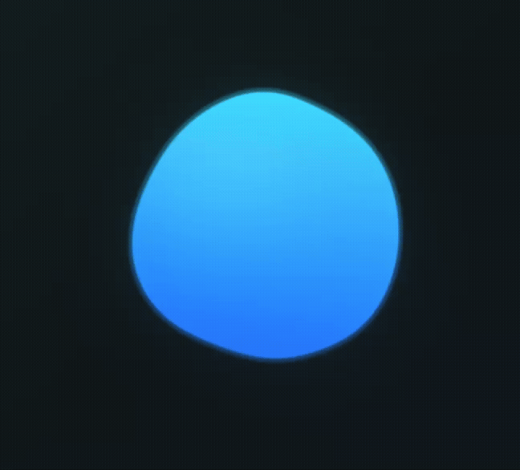 | **Liquid orb** · `.liquidOrb()`<br>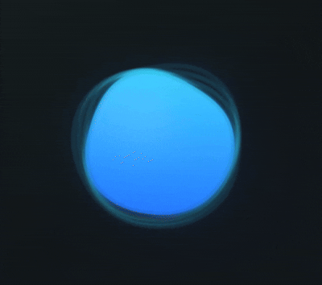 |
| **Wave** · `.wave()`<br>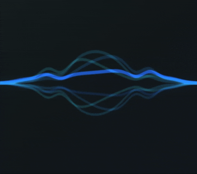 | **Ribbon** · `.ribbon()`<br>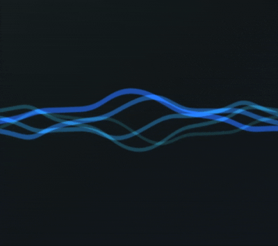 |
| **Spectrum** · `.bars()`<br> | **Upward bars** · `.upwardBars()`<br>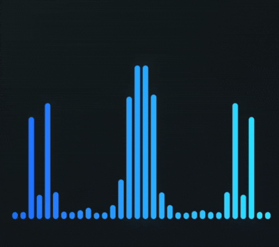 |
| **Voice bars** · `.voiceBars()`<br>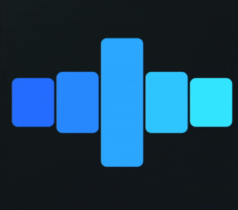 | **Mirror spectrum** · `.mirrorSpectrum()`<br>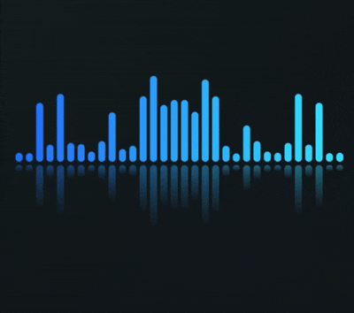 |
| **Halo** · `.halo()`<br>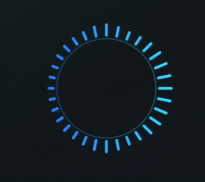 | **Voice bloom** · `.voiceBloom()`<br>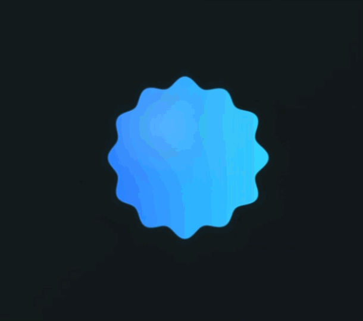 |
| **Pulse rings** · `.pulseRings()`<br>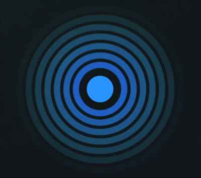 | **Dot spectrum** · `.dotSpectrum()`<br>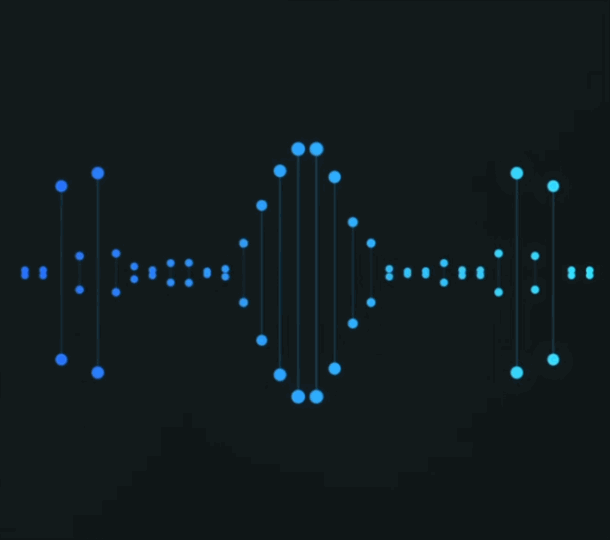 |
| **Capsule bars** · `.capsuleBars()`<br>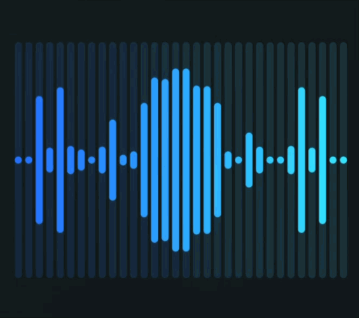 | **Minimal line** · `.minimalLine()`<br>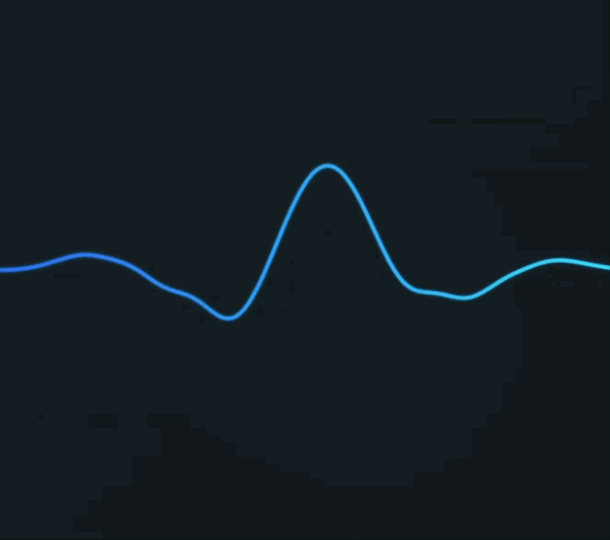 |

### All style fields

| Field | Generic constructor default | Range / behavior |
| --- | --- | --- |
| `kind` | `.orb` | A `VoiceVisualizerKind` value from the table below |
| `colors` | `[]` | Empty selects widget defaults; one is solid; multiple are evenly spaced stops |
| `inactiveColor` | `null` | Null retains active colors in silence; otherwise blend from this resting color |
| `barCount` | `32` | 3–128; base count for count-based styles |
| `spacing` | `3` | Non-negative logical pixels between bars; reduced if needed to fit |
| `cornerRadius` | `8` | Non-negative logical pixels; bar painters cap at half bar width |
| `glow` | `0.25` | 0–1; zero disables optional glow |
| `density` | `1` | Greater than 0, at most 3; scales detail/count with style-specific caps |
| `scale` | `1` | Greater than 0, at most 4; resizes the style around its center without changing widget bounds |
| `symmetric` | `true` | Mirror frequency sampling where supported; wave also adds reflected curves |
| `direction` | `.both` | `VoiceVisualizerDirection.up`, `.down`, `.both`, or `.radial` |

Fields apply where the selected shape supports them. Bars, wave, dots, capsules,
and minimal line interpret direction; radial shapes keep radial geometry. Ribbon
and mirror spectrum retain their own layouts. Spacing/corner radius do not reshape
fluid effects. Halo has 12–192 rays and bloom 6–12 lobes after density/capping;
fixed wave/ribbon layers and some shader effects do not use `barCount`. In `both`
mode, dot spectrum draws matching dots above and below its center line. Explicit
`up`/`down` directions retain their one-sided baselines.

### Named constructors and defaults

Every named constructor accepts `colors`, `inactiveColor`, `glow`, `density`,
`scale`, and `symmetric`. The table shows **all remaining exposed parameters** and any changed
common defaults. Values not listed use `density: 1`, `scale: 1`, `symmetric: true`,
empty colors, and no inactive color. Constructor names also name the `VoiceVisualizerKind`
values.

| Constructor | Appearance | Glow | Other exposed parameters / changed defaults |
| --- | --- | --- | --- |
| `.orb()` | Layered radial orb | `0.3` | None |
| `.wave()` | Smooth layered waveform | `0.2` | `direction: .both` |
| `.bars()` | Rounded centered spectrum | `0.2` | `barCount: 24`, `spacing: 3`, `cornerRadius: 8`, `symmetric: false`, `direction: .both` |
| `.upwardBars()` | Bars rising from a lower baseline | `0.2` | `barCount: 24`, `spacing: 3`, `cornerRadius: 8`, `symmetric: false`, `direction: .up` |
| `.voiceBars()` | Compact voice-focused pills | `0.25` | `barCount: 5`, `spacing: 5`, `cornerRadius: 12`, `direction: .both` |
| `.halo()` | Rounded radial rays and an inner ring | `0.3` | `barCount: 64`, `spacing: 2`, `cornerRadius: 8`, `direction: .radial` |
| `.mirrorSpectrum()` | Bars with a separated fading reflection | `0.22` | `barCount: 32`, `spacing: 3`, `cornerRadius: 8`, `direction: .both` |
| `.ribbon()` | Broad flowing strands | `0.28` | `direction: .both` |
| `.liquidOrb()` | Fluid orb membranes | `0.45` | `density: 1.2` |
| `.pulseRings()` | Expanding rings with a central core | `0.35` | None |
| `.dotSpectrum()` | Frequency dots and trails | `0.35` | `barCount: 28`, `spacing: 5`, `symmetric: false`, `direction: .up` |
| `.capsuleBars()` | Energy-filled tracks | `0.18` | `barCount: 20`, `spacing: 4`, `cornerRadius: 99`, `symmetric: false`, `direction: .up` |
| `.voiceBloom()` | Soft continuous petals | `0.48` | `barCount: 24`, `spacing: 2`, `direction: .radial` |
| `.minimalLine()` | Compact waveform line | `0.12` | `symmetric: false`, `direction: .both` |

`copyWith({kind, colors, inactiveColor, clearInactiveColor, barCount, spacing,
cornerRadius, glow, density, scale, symmetric, direction})` preserves omitted/null values.
`clearInactiveColor: true` removes the resting color even if an `inactiveColor` is
also supplied. Changing `kind` preserves existing configuration; it does not apply
the new kind's named-constructor defaults.

```dart
final style = const VoiceVisualizerStyle.bars(
  colors: [Colors.blue, Colors.cyan, Colors.purple, Colors.pink],
  inactiveColor: Colors.grey,
  scale: 0.8, // Shrink the bars inside the same widget bounds.
).copyWith(barCount: 40, spacing: 2, clearInactiveColor: true);
```

`size` controls the widget's layout box. `style.scale` controls how large the
visual appears inside that box. For example, a `280 × 280` widget with
`scale: 0.7` keeps its layout size but draws the effect at 70%. Values above 1
enlarge the effect and clip anything outside the widget bounds.

## Motion controls

`AudioMotionPreset` provides `.voice`, `.music`, `.ambient`, and `.energetic`.
Use `AudioMotionSettings.preset(preset)` as a starting point, then `copyWith()` to
change individual settings. Supplying `motion` replaces the widget preset entirely.

| `AudioMotionSettings` parameter | Explicit constructor default | Meaning |
| --- | --- | --- |
| `bassAttack`, `bassRelease` | Required | Positive rise/fall durations for bass |
| `midsAttack`, `midsRelease` | Required | Positive rise/fall durations for midrange |
| `trebleAttack`, `trebleRelease` | Required | Positive rise/fall durations for treble |
| `levelAttack`, `levelRelease` | Required | Positive rise/fall durations for overall level |
| `peakHold` | `100 ms` | Non-negative time to hold a peak |
| `peakFalloff` | `0.85` | Positive normalized units/second after hold |
| `noiseGate` | `0.006` | RMS threshold in 0–1, excluding 1; quieter input treated as silence |
| `adaptiveGain` | `true` | Adapt sensitivity to source level |
| `idleBreathing` | `0.025` | Idle movement in 0–1; zero permits a motionless rest |

Use positive attack/release durations for stable interpolation. `copyWith()`
accepts every constructor field; null preserves its value. Settings support value
equality. Preset durations below are milliseconds, shown as attack/release pairs.

| Preset | Bass | Mids | Treble | Level | Peak hold / falloff | Gate | Adaptive gain | Idle |
| --- | --- | --- | --- | --- | --- | --- | --- | --- |
| `voice` | 28/220 | 52/290 | 85/390 | 42/310 | 100 / 0.85 | 0.007 | true | 0.018 |
| `music` | 18/170 | 32/230 | 48/300 | 28/240 | 100 / 0.85 | 0.003 | false | 0.012 |
| `ambient` | 110/650 | 150/800 | 210/950 | 130/800 | 100 / 0.85 | 0.002 | true | 0.055 |
| `energetic` | 10/105 | 16/135 | 24/175 | 14/125 | 145 / 1.15 | 0.004 | true | 0.03 |

```dart
final motion = AudioMotionSettings.preset(AudioMotionPreset.voice).copyWith(
  noiseGate: 0.01,
  idleBreathing: 0,
  peakHold: const Duration(milliseconds: 140),
);

ReactiveAudioVisualizer(controller: audio, motion: motion);
```

## Rendering and shader loading

| `VoiceVisualizerRenderer` | Behavior |
| --- | --- |
| `auto` | Use GPU for supported styles; Canvas otherwise |
| `canvas` | Always draw with Canvas |
| `fragmentShader` | Request GPU, retaining the same fallback rules |

GPU styles: **orb, wave, halo, ribbon, liquidOrb, pulseRings, voiceBloom**.
Other styles use Canvas. While shaders load, when loading fails, or when a palette
has more than four colors, widgets use Canvas. One through four GPU color stops
retain intermediate colors. Geometry, lighting, and some style controls remain
renderer-specific; outputs are not pixel-identical. Halo and bloom use a seamless
spatial gradient rather than a discontinuous angular palette.

`Future<void> precacheWaveformsAudioShaders()` optionally loads the cached program
before displaying a visualizer. Call after Flutter binding initialization. It has
no arguments and propagates loading errors; widgets themselves handle failures by
falling back to Canvas. Example optional warmup:

```dart
WidgetsFlutterBinding.ensureInitialized();
try {
  await precacheWaveformsAudioShaders();
} catch (_) {
  // Canvas remains available if this platform cannot load the shader.
}
```

No extra shader declaration is needed in the consuming app. Audio decoding,
analysis, envelope updates, and scheduling run on the CPU for both renderers.

## Classic waveform API

### `AudioData` and `AudioProcessor`

| API | Behavior |
| --- | --- |
| `AudioData({required Iterable<double> samples, double maxAmplitude = 1.0})` | Copy samples into an immutable snapshot; does not normalize or clamp |
| `AudioData.samples` | Unmodifiable list; changing the original input cannot bypass repainting |
| `AudioData.maxAmplitude` | Original peak metadata; finite and non-negative, otherwise `ArgumentError` |
| `AudioData.empty()` | Empty snapshot with default maximum amplitude 1 |
| `AudioProcessor.extractPeaks(List<double> rawSamples, int bucketCount, {bool normalize = true})` | Largest absolute sample per bucket; optional scaling so largest peak is 1; returns `AudioData` |

Use finite samples. Empty input or nonpositive `bucketCount` returns empty data.
The bucket count is capped to input length. `maxAmplitude` retains the original
largest peak before normalization; extraction is for visual buckets, not PCM
sample-rate conversion.

### `AudioVisualizer`

| Parameter | Default | Meaning |
| --- | --- | --- |
| `key` | `null` | Standard widget identity |
| `audioData` | Required | Snapshot with one sample per segment |
| `size` | `Size(double.infinity, 200)` | Logical dimensions; bounded parent width required |
| `type` | `VisualizerType.linear` | `.linear`, `.circular`, or `.oval` |
| `color` | `Colors.blue` | Segment color |
| `strokeWidth` | `2` | Positive logical-pixel thickness |
| `spacing` | `2` | Non-negative gap for linear bars; ignored for radial layouts |
| `animatePulsate` | `false` | Loop a gentle amplitude pulse |
| `animateRotation` | `false` | Rotate circular/oval layouts; ignored for linear |
| `animationDuration` | `2 seconds` | Positive duration for one complete loop |
| `transitionDuration` | `100 ms` | Non-negative amplitude easing; zero updates immediately |

```dart
AudioVisualizer(
  audioData: AudioProcessor.extractPeaks(samples, 100),
  type: VisualizerType.linear,
  spacing: 4,
  strokeWidth: 3,
  animatePulsate: true,
);
```

New data eases from the displayed snapshot. A changed sample count, zero transition
duration, or system reduced motion causes an immediate update. Reduced motion
also stops pulse and rotation loops.

### `LiveAudioVisualizer`

Accepts the same `key`, `size`, `type`, `strokeWidth`, `spacing`, `animatePulsate`,
`animateRotation`, `animationDuration`, and `transitionDuration` parameters/defaults
as `AudioVisualizer`, with these differences:

| Parameter | Default | Meaning |
| --- | --- | --- |
| `audioStream` | Required | `Stream<List<double>>`; replaces `audioData` |
| `windowSize` | `100` | Positive number of recent chunk peaks to display |
| `color` | `Colors.redAccent` | Segment color |

```dart
LiveAudioVisualizer(
  audioStream: monoPcmStream,
  windowSize: 80,
  type: VisualizerType.linear,
);
```

Each nonempty chunk contributes its largest finite absolute sample, clamped to
0–1. History starts with zeros; its duration depends on **chunk arrival cadence**.
Changing the stream replaces the subscription while retaining history. Resizing
trims old buckets or prepends zeros. The widget cancels its subscription on dispose
but does not close your source. Handle input errors upstream: this widget has no
`onError` parameter.

## Troubleshooting

| Symptom | Check |
| --- | --- |
| Nothing reacts | Widget subscribed before audio arrived; input is PCM, not compressed/base64 text passed as bytes |
| Frequency response looks wrong | Source rate, encoding, endian, and channel layout match the real input |
| Animation leads the sound | Forward PCM when played rather than when a complete API response downloads |
| Speaker colors do not change | Explicit `style.colors` overrides speaker palettes |
| More than four colors use Canvas | Intentional fallback to preserve every stop |
| Style option has no visible effect | Check that the selected shape/renderer uses that option |
| Movement remains in silence | Set `motion.idleBreathing` to zero |
| Unbounded width error | Place the widget in a bounded parent, or set a finite `size.width` |

## Example, API docs, and checks

```sh
cd example
flutter run
```

The example offers microphone input and synthetic signals. Choose **Demo signal**,
then **Full mix** to drive bass, voice, and air together; individual **Bass**,
**Voice**, and **Air** choices isolate each range. Synthetic signals animate the
visualizer without audible playback. Microphone audio stays
in memory and is not uploaded or saved by the example.

Public API is exported from `package:waveforms_audio/waveforms_audio.dart`.
Canvas painters and analysis internals under `src/` are implementation details.
Dart documentation comments provide IDE help for constructors, fields, and methods.

From the package root:

```sh
flutter analyze
flutter test
(cd example && flutter test)
dart doc
```

`dart doc` writes browsable API documentation under `doc/api/`.
